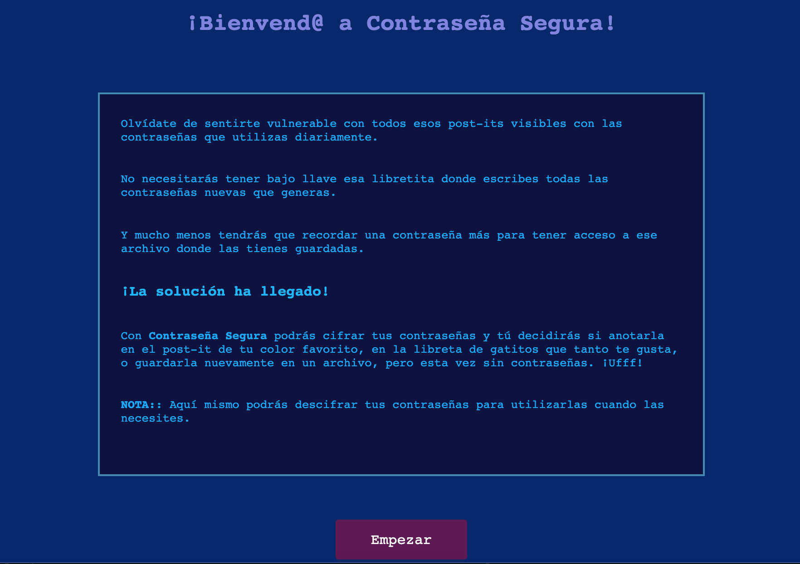

# Contraseña Segura

**¿Por qué utilizar Contraseña Segura?**

Esta web app está diseñada para aquellos usuarios que acostumbran guardar sus contraseñas de uso diario en archivos, en alguna libreta o hasta en post-its. Estos usuarios corren el riesgo de que alguien más pueda acceder a sus contraseñas y hacer mal uso de ellas. 

Al desarrollar esta app le permitimos al usuario seguir utilizando estas opciones, pero sin sentirse vulnerable a que alguien más tenga acceso a su información, a pesar de que ésta se encuentre visible y al alcance de otras personas.

**¿Cómo funciona "Contraseña Segura"?**

La app cifrará la contraseña que el usuario eliga y le mostrará su contraseña cifrada, para que pueda guardarla en un archivo, anotarla nuevamente en alguna libreta o post-it, para su rápido acceso. Así mismo, la app le permitirá descifrar la contraseña para que pueda usarla cuando sea necesario, ya sea para ingresar a algún sitio/app o para modificarla.

Al cifrar la contraseña, el usuario tiene la opción de elegir un código específico para personalizar su cifrado. Este mismo código lo deberá utilizar para poder descifrar su contraseña cuando lo necesite. De este modo se brinda mayor seguridad durante el cifrado de la información.

**Características de la app**

La aplicación está basada en el cifrado césar, en el cual se sustituye una letra por otra que se encuentre cierto número de posiciones adelante o atrás, dentro del abecedario. 

El código que el usuario elige es el que determina la posición de la letra que sustituirá a la letra(s) que el usuario ingrese.

La aplicación acepta letras en mayúsculas o minúsculas, así como caracteres especiales, números y espacios. Se basa en el alfabeto aceptado por la RAE, es decir, sin incluir la ñ.

Cada código representa un número específico que indicará el número de saltos que dará cada letra para ser cifrada. Se utilizaron nombres de códigos en lugar de números para que el usuario pueda recordarlo con mayor facilidad y pueda recurrir a el cuando necesite descifrar sus contraseñas.

**Instrucciones**

1. El usuario deberá elegir si quiere cifrar o descifrar su contraseña.
2. Una vez dirigido a la pantalla deseada, el usuario deberá teclear el texto, ya sea para cifrar o descifrar.
3. Tendrá que elegir uno de los codigos mostrados para poder cifrar o descifrar su contraseña.
4. Posteriormente, deberá dar click en el botón de "CIFRAR" o "DESCIFRAR" para que la aplicación le muestre el nuevo texto.
5. Finalmente, el usuario podrá copiar el texto para guardarlo en algún archivo o anotarlo en donde desee.

Es IMPORTANTE que el usuario utilice el mismo código con el que cifró cuando quiera descifrar sus contraseñas.

**Futuros alcances**

Desarrollar un app movil que permita al usuario cifrar sus contraseñas y guardarlas ya cifradas y en la misma app pueda descifrarlas para poder acceder a ellas. La contraseña descifrada no se guardará por cuestiones de seguridad.

Para acceder a esta app ingresa al siguiente link:
[Contraseña Segura](https://taniatenorio.github.io/cifrado-cesar/src/index.html)

